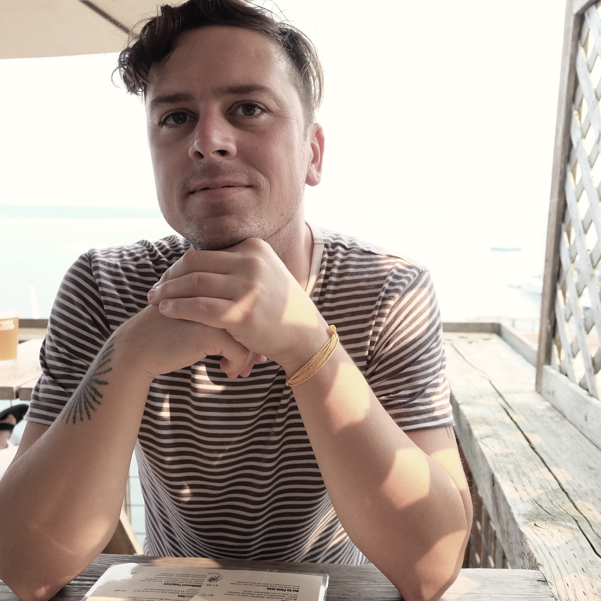
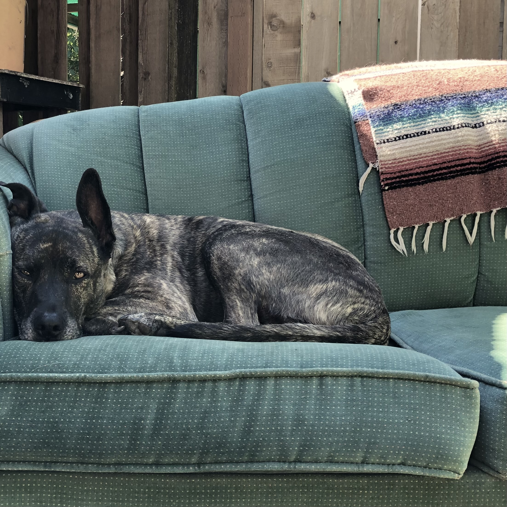
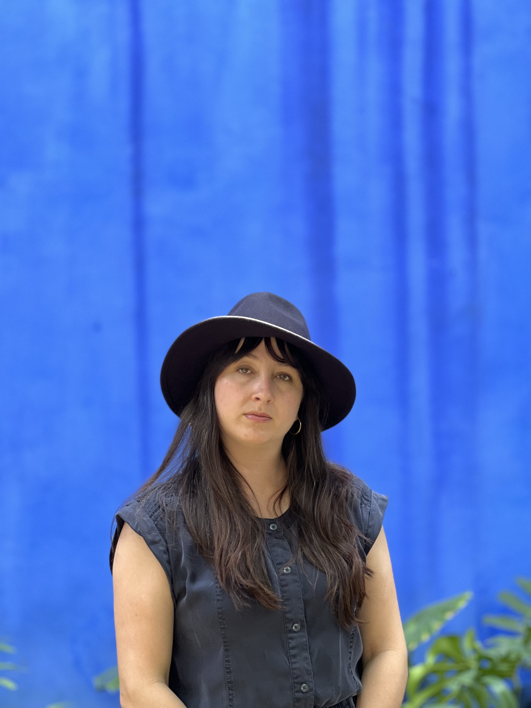

### Hi, I'm Adam! 

___

### About me:

I am a full-stack software developer currently living in the Pacific Northwest of the United States.  As I approach the eight-month mark, I am young in my developer journey.  At times I find this informs a kind of idealistic optimism in me towards software.  This impulse is tempered, however, by prior professional and academic experience, which has taught me that a deliberate and pragmatic approach is one of the most powerful and effective tools for analytical problem-solving.  In working with systems, I value careful ingenuity and a conventionally-rooted practice.  With a focus on sound fundamentals, I strive to always consider the next-reader when considering work at-hand.  When experiencing a work of art or technology, at first I gravitate towards aesthetic of design, but quickly develop a thirst for understanding any causal relationships among the features, underlying the functionality.  I am currently a student at Alchemy Code Lab, in Portland, Oregon.  I will graduate in February 2023.

___

___
