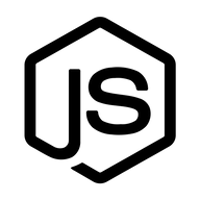

### Hi, I'm Adam!
  
___

#### Tools

     

___

#### Details

I am a full-stack software developer living in Portland, Oregon.  My objective as a software developer is to find a role in which I can contribute to the creation of quality technologies that are accessible to people across the socioeconomic spectrum.  I am a diligent and discerning individual who thrives in collaboration with others toward a shared goal.  Through prior professional and academic experience, I have developed a perspective informed by analytical reflection and critical examination, as well as verbal and written communication habits, that reflect an empathetic pathos and methodical technique.  My aspiration is to find an organization focusing on practices like mitigating its carbon footprint, and removing cultural impediments to a reality that views difference as strength, and variety as an indication of a robust environment.  I am preparing to graduate from Alchemy Code Lab in February 2023.

___
