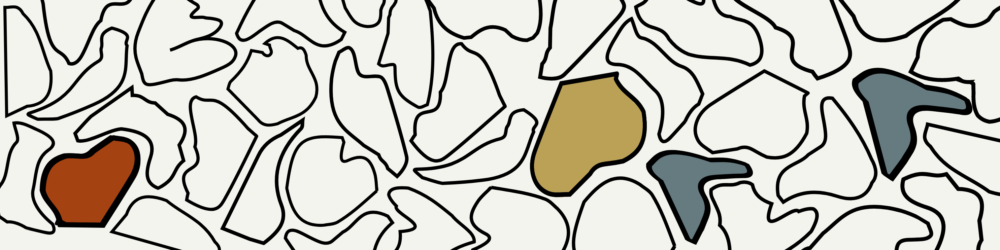

# Adam-Robson 🎈

## I am currently working on

- refining how i implement projects and strategies
- improving my communication
- providing guidance for local usage
- updating existential dependencies
- strengthening quality assurance by thoroughly questioning
- continuously integrating
- promptly addressing insecurities
- addressing and then reinforcing vulnerabilities

## I currently enjoy

### Separating Concerns

Breaking down the system into distinct parts

### Avoiding duplication

Abstract common logic for reuse

### Simplicity

Seek clarity and focus in design

### Material Honesty

Bring the inherent qualities & textures into focus

## This space

This is a space where source code can be safely deployed, where resources
can be played with, where learning new things is encouraged, and development
and sharing is celebrated.

## Contact Detail 🧶

If you have any questions or are curious about working with the owner of
this repository, please feel free to touch base through
[linkedin](https://linkedin.com/in/adamrayrobson),
[X](https://x.com/adamrayrobson),
or [facebook](https://facebook.com/thisisanatom).
